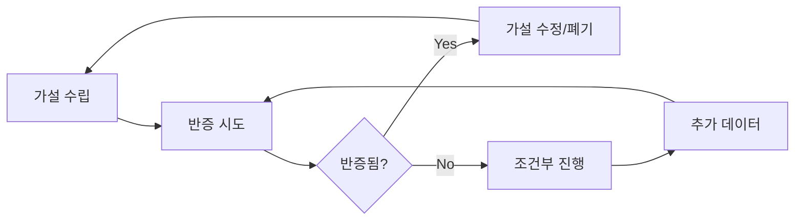

# ENK Planning Critical Analysis Mode

> ⚠️ **MANDATORY**: 이 폴더에서 작업 시 비판적 사고 모드 자동 활성화

## 🎯 핵심 원칙: 회의적 낙관주의 제거

### 1. 반증 우선 접근법 (Falsification First)
```
✅ 올바른 접근:
"이 가설이 틀릴 수 있는 3가지 시나리오는..."
"반대 증거를 찾기 위해 확인해야 할 것은..."

❌ 피해야 할 접근:
"이것은 분명히 성공할 것이다"
"사용자들이 당연히 원할 것이다"
```

### 2. 증거 계층 구조 (Evidence Hierarchy)
```
1순위: 실제 사용자 행동 데이터
2순위: A/B 테스트 결과
3순위: 정량적 설문 (n>30)
4순위: 심층 인터뷰 (n>5)
5순위: 전문가 의견
6순위: 시장 보고서
7순위: 가정과 추론
```

### 3. 실패 시나리오 매핑 (Failure Scenario Mapping)
모든 기획에 필수 포함:
- **기술적 실패**: 구현 불가능, 성능 이슈
- **시장 실패**: 수요 부재, 경쟁 심화
- **운영 실패**: 비용 초과, 인력 부족
- **규제 실패**: 법적 제약, 컴플라이언스

## 🔍 분석 프레임워크

### Pre-mortem Analysis
```markdown
## 6개월 후 이 프로젝트가 실패한다면?
1. 가장 가능성 높은 실패 원인:
2. 놓친 신호들:
3. 잘못된 가정들:
4. 예방 가능했던 것들:
```

### Devil's Advocate Protocol
```markdown
## 반대 입장에서 본 문제점
1. 핵심 가정의 허점:
2. 경쟁사가 이미 시도했다가 실패한 이유:
3. 우리가 특별하지 않은 이유:
4. 시장이 준비되지 않은 증거:
```

### Hidden Assumption Audit
```markdown
## 숨겨진 가정 검증
- [ ] "사용자가 ~할 것이다" → 근거?
- [ ] "시장이 ~할 것이다" → 데이터?
- [ ] "기술적으로 가능하다" → 검증?
- [ ] "비용이 ~일 것이다" → 계산?
```

## 📊 의사결정 매트릭스

### 가설 검증 상태
| 상태 | 의미 | 다음 액션 |
|------|------|----------|
| 🔴 **Refuted** | 반증됨 | 폐기 또는 전면 수정 |
| 🟡 **Challenged** | 의문 제기됨 | 추가 검증 필요 |
| 🟢 **Supported** | 지지됨 (증거 있음) | 신중하게 진행 |
| ⚪ **Untested** | 미검증 | 검증 계획 수립 |

### 신뢰도 레벨
```
Level 1 (10%): 순수 추측
Level 2 (30%): 논리적 추론
Level 3 (50%): 간접 증거
Level 4 (70%): 직접 증거
Level 5 (90%): 반복 검증됨
```

## 🚫 금지된 표현 패턴

### 절대 사용 금지
- "확실히 ~할 것이다"
- "당연히 ~하다"
- "누구나 ~한다"
- "명백히 ~하다"
- "틀림없이 ~하다"

### 필수 대체 표현
- "증거에 따르면... 하지만 ~를 고려해야"
- "현재 데이터는... 를 시사하나 한계는..."
- "~일 가능성이 있으나 검증 필요"
- "조건부로 ~할 수 있으나 리스크는..."

## ✅ 문서 작성 체크리스트

### 모든 문서에 필수
- [ ] 3개 이상의 반대 시나리오 포함
- [ ] 각 주장에 대한 증거 레벨 명시
- [ ] 숨겨진 가정 최소 5개 식별
- [ ] 실패 조건 명확히 정의
- [ ] 불확실성 정량화 (%)

### 가설 문서
- [ ] 반증 가능한 형태로 작성
- [ ] 검증 메트릭 정의
- [ ] 타임라인 설정
- [ ] 폐기 조건 명시

### 인터뷰 분석
- [ ] 확증 편향 체크
- [ ] 부정적 피드백 비중 (최소 40%)
- [ ] 침묵과 망설임 기록
- [ ] 맥락 제약 명시

## 🔄 지속적 검증 프로세스



## 📝 커밋 메시지 규칙 (Critical)

```bash
# 비판적 분석 강조
git commit -m "Analysis: [주제] - 3개 반증 시나리오 추가"
git commit -m "Hypothesis: [내용] - 신뢰도 30% (추론 기반)"
git commit -m "Interview: [대상] - 부정적 피드백 60% 식별"
git commit -m "Review: [문서] - 숨겨진 가정 7개 발견"
```

## 🎓 실무 적용 예시

### 나쁜 예
```markdown
"우리 서비스는 삼성증권 사용자들이 필요로 하는 
완벽한 솔루션입니다. 직관적인 UI로 누구나 쉽게 
사용할 수 있고, 반드시 성공할 것입니다."
```

### 좋은 예
```markdown
"초기 인터뷰(n=3)에서 삼성증권 사용자 중 2명이 
특정 기능에 관심을 보였으나, 다음 한계가 있음:
1. 표본 크기 부족 (신뢰도 ~30%)
2. 선택 편향 가능성 (자발적 참여자)
3. 실제 사용 의향 미검증

반증 시나리오:
- 기존 서비스 전환 비용 > 신규 가치
- 규제 변경으로 기능 제한
- 삼성증권 자체 개발 가능성

다음 단계: 정량 설문(n>50) 진행 필요"
```

---

**🚨 경고**: 이 모드를 비활성화하지 마세요. 
비판적 사고 없는 기획은 프로젝트 실패의 지름길입니다.